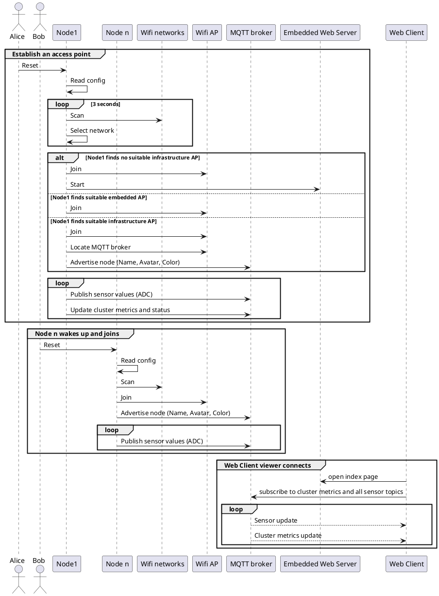
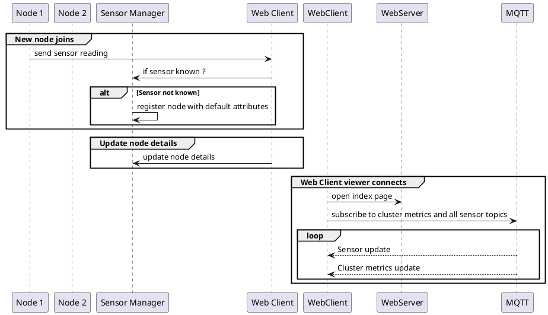
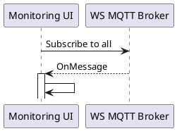

# Chibit Sensor Bracelet for ESP82xx

## Web application

Upon startup, the Chibit master node will startup an asynchronous Web Server that
can show the status of all connected bracelets and allow various interactions.
To develop the web application, you can invoke the maven build tool, that will
download and start a local web server. In this mode, bracelet interactions are simulated
by mouse clicks.

To assemble the web application :

* On Linux / Mac OSX :  ```./mvnw compile jetty:run```
* On Windows : ```mvnw.cmd compile jetty:run```

It will download all web libraries and resources and run a webserver at http://localhost:8080.
During execution, the `src/main/webapp` folder will be scanned and changes reflected in your running application (upon reloading the web page).

To prepare the `data` folder before upload to the SPIFFS image on the ESP8266 :

* On Linux / Mac OSX :  ```./mvnw package```
* On Windows : ```mvnw.cmd package```

Note that only minified resources will be copied, to the root of the file system.

## Bracelet documentation

### Sensor design principles
The bend sensor should be set against the wrist, palm and fingers vertical above the thumb and below the wrist.
The bend sensor's resistance increases with the curvature, we should measure the difference between two extreme positions and the difference of resistance.

:warning: Two different sensors might offer different resistance levels. Calibration data will be collected when the microcontroller starts up if needed (or if the onboard FLASH button is long-pressed).


### Sensor activity sequence diagram


### Web application : Sensor Manager sequence diagram



### Monitoring web interface

The monitoring web interface is used to check that sensors are publishing values correctly and currently connected to the MQTT broker.


